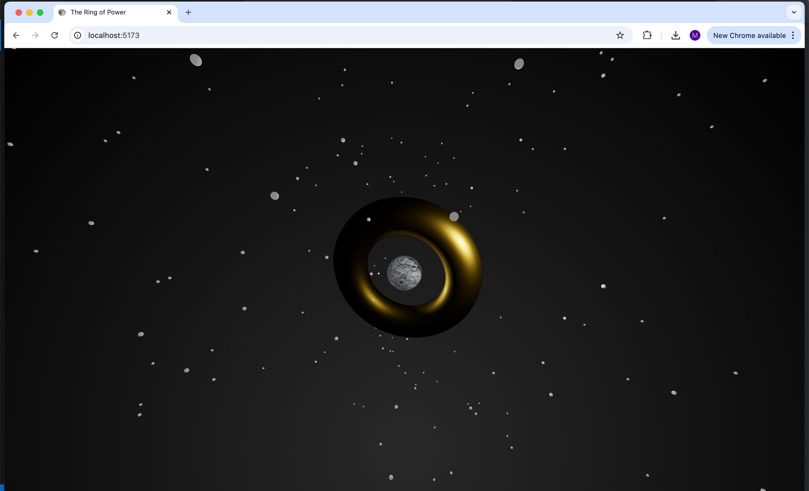

# The Ring of Power

This Three.js project features a rotating torus surrounded by a moon, enhanced with realistic lighting, textures, and shadows. The project serves as a personal, hands-on exploration of Three.js concepts such as scene setup, camera control, lighting, material properties, and shadow mapping.

All core functionality is implemented in the `main.js` file.

## How to Run

1. **Clone the Repository**:
   ```bash
   git clone https://github.com/mustafa-ahmed1118/ring-of-power.git
   ```
2. **Install the dependencies**:
   ```bash
   npm install
   ```
3. **Run the program**:
   ```bash
   npm run dev
   ```
4. After running, you should be provided with a local host link, e.g., `http://localhost:5173/`.

5. Visit the local host link provided to you.

## How to Use:

Once running, you can rotate the camera and zoom in and out using the mouse to explore the scene.

_Get spinning, my friend._

## The Foundations of Three.js

- **Scene Object**: The scene contains all the elements in the 3D world (torus, moon, stars, lights, etc.).
- **Camera Object**: The camera defines the view into the 3D world that will be rendered for the user. In this project, the camera is positioned at `Z=30` and can be adjusted with the mouse.
- **Renderer Object**: The renderer takes the camera view and displays it on the screen. This project uses `WebGLRenderer` to output the 3D scene to an HTML canvas.
- **Lighting**: Point lights are used to illuminate the scene, casting shadows and creating realistic light interactions.
  - `PointLight`: Two point lights illuminate the scene from different angles and cast shadows onto the objects.
  - `AmbientLight`: Provides a general ambient light to ensure all objects are slightly visible.
- **Texture Mapping**: Textures are applied to the moon and torus for added detail. A normal map is used on the moon's surface for additional depth.
- **Shadow Effects**: Shadows are enabled throughout the scene to add realism. The torus casts shadows, and the moon receives them, enhancing the depth and interaction of light.

## Key Components:

- **Torus Geometry**: The rotating torus represents a central feature of the scene, with material properties like clearcoat, roughness, and metalness for a shiny, reflective surface.
  - The torus rotates continuously on the `x`, `y`, and `z` axes.
  - It casts shadows onto the scene, creating dynamic lighting effects.
- **Moon Geometry**: The moon is positioned to orbit around the torus, with a texture map and normal map applied for surface detail.
  - The moon is set to receive shadows cast by the torus and the point lights, adding realistic light interactions.
- **Stars**: The background is filled with 200 randomly placed stars, adding to the cosmic environment.

## Lighting and Shadows:

- **Shadows**: Both point lights cast shadows, which are mapped for higher quality. The torus and moon interact with these shadows to create a realistic environment.

  - `pointLight.shadow.mapSize.width = 1024` (for better shadow resolution).
  - `pointLight2.shadow.mapSize.width = 1024` (for second light).
  - Shadows are rendered softly using `THREE.PCFSoftShadowMap`.

- **Materials**: The torus uses a material that features clearcoat and metalness, making it highly reflective. The moon uses a standard material with a diffuse texture and a normal map.

## Code Walkthrough

1. **Scene Setup**:
   - A `THREE.Scene` is created to hold the 3D objects.
   - A `THREE.PerspectiveCamera` is used to view the scene.
   - A `THREE.WebGLRenderer` renders the scene to the screen with shadow and lighting effects enabled.
2. **Torus Geometry**:

   - A `THREE.TorusGeometry` is created and wrapped in a `THREE.MeshPhysicalMaterial`. The torus is given a reflective surface using `clearcoat` and `metalness` properties, and normal maps for surface detail.
   - The torus is added to the scene and set to cast shadows.

3. **Moon Geometry**:

   - A `THREE.SphereGeometry` is used to create the moon, with a texture map and normal map applied.
   - The moon is set to receive shadows cast by other objects in the scene.

4. **Lighting**:

   - Two `THREE.PointLight` objects are used to illuminate the scene, casting shadows on the torus and moon.
   - An additional `THREE.AmbientLight` is added to provide soft ambient lighting.

5. **Starfield**:

   - Randomly placed stars are generated in the background using small `THREE.SphereGeometry` objects.

6. **Camera Controls**:

   - The `OrbitControls` library allows the user to interact with the camera by rotating and zooming.

7. **Animation**:
   - The `animate` function continuously updates the scene, rotating the torus and rendering the scene.

## Important Notes:

- **Performance Considerations**:

  - Shadows and reflections can be computationally expensive, so performance might degrade on lower-end devices.
  - Texture and shadow map resolutions can be adjusted for performance.

- **Responsive Design**: The canvas resizes dynamically to fit the window size.
  - `renderer.setSize(window.innerWidth, window.innerHeight);`
